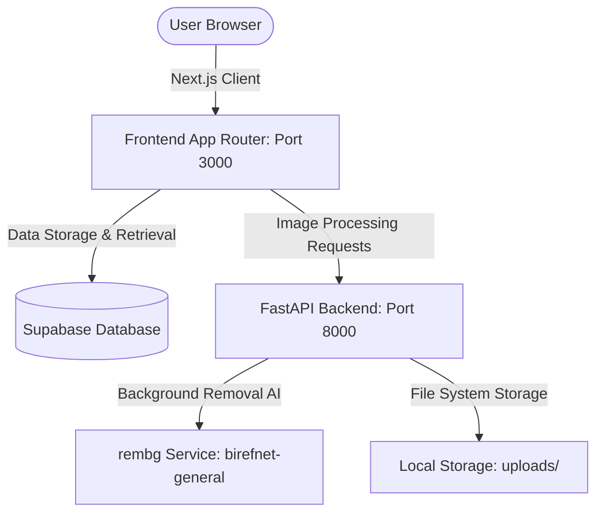

# DigiScale Product Studio Architecture

This document describes the high-level system architecture and data flow for DigiScale Product Studio.

## Architecture Diagram



## Core Components

### 1. Frontend (Next.js App Router)
- **Framework**: Next.js 15+ with TypeScript, Tailwind CSS, and Shadcn UI.
- **State & Data Fetching**: Utilizes Supabase Client SDK to directly query and write collection and product data.
- **Pages & Routes**:
  - `(auth)`: Login, signup, forgot-password, reset-password.
  - `(dashboard)`:
    - `/dashboard`: Main dashboard with statistics and overview.
    - `/workspace`: Interactive workspace for uploading image, removing backgrounds in real-time, editing publish settings, canvas scaling, and white background preview.
    - `/projects` (Collections): View, search, and manage product collections.
    - `/quotation`: Dynamic quotations generator based on product variables.
    - `/settings`: Account and plan settings.

### 2. Backend (FastAPI Server)
- **Framework**: FastAPI (Python 3.14+) running via Uvicorn.
- **Service**: Processes background removal tasks synchronously and returns local URLs for the processed images.
- **AI Background Removal**: 
  - Powered by the `rembg` library using the state-of-the-art `birefnet-general` model.
  - Optimized for CPU execution by resizing/constraining preview images to a maximum size of 1600px.
- **HEIF/HEIC Support**: Powered by `pillow-heif` to accept uploads from iOS devices.
- **Storage**: Stores original and processed images locally under the `uploads/` directory which is mounted as a FastAPI static folder (`/uploads`).

### 3. Database (Supabase)
- Distributed Postgres database hosted on Supabase.
- Stores metadata for collections (equivalent to projects) and products (equivalent to processed images).

---

## Detailed Data Flows

### Image Upload and Background Removal Pipeline
1. The user drops or uploads an image in the **Workspace** (`/workspace`).
2. The frontend sends a `POST` request to `http://localhost:8000/upload` with the image file.
3. The backend receives the file, checks the format (allowing HEIC/HEIF via `pillow-heif`), and saves it to `uploads/originals/`.
4. The backend runs background removal using `rembg` with the pre-cached session of `birefnet-general`.
5. The processed image is saved to `uploads/processed/` as a PNG to maintain transparency.
6. The backend returns:
   ```json
   {
     "message": "Image processed successfully",
     "originalImage": "uploads/originals/filename_orig.webp",
     "processedImage": "uploads/processed/filename_proc.png",
     "imageId": null,
     "creditsRemaining": null
   }
   ```
7. When the user chooses a **Target Collection** and clicks **Publish Settings**, the frontend saves the new product entry to Supabase using:
   - `collection_id`: The ID of the selected collection.
   - `photoUrl`: `http://localhost:8000/uploads/processed/filename_proc.png`.
   - `name`, `stock`, `rate`, etc.
