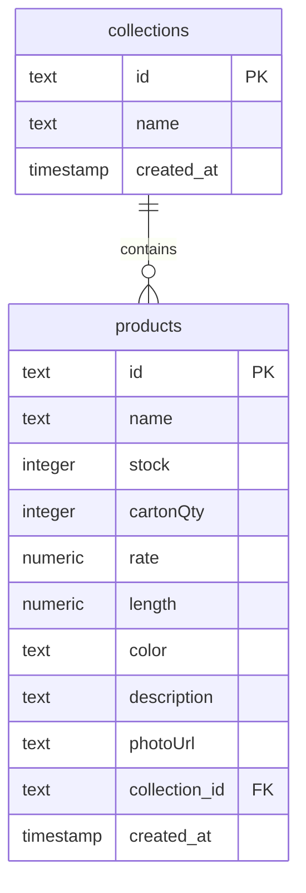

# DigiScale Product Studio Database Schema

DigiScale Product Studio uses **Supabase (PostgreSQL)** for primary data storage. Below is the schema documentation for the active tables.

---

## 1. `collections` Table
Stores project-level groupings of product images (called collections).

| Column Name  | Data Type                | Constraints                | Description                               |
|--------------|--------------------------|----------------------------|-------------------------------------------|
| `id`         | `text`                   | `PRIMARY KEY`, Default UUID| Unique identifier for the collection      |
| `name`       | `text`                   | `NOT NULL`                 | Name of the collection (e.g. V1, Hello)   |
| `created_at` | `timestamp with time zone` | Default `now()`            | Timestamp when the collection was created|

---

## 2. `products` Table
Stores individual processed product entries, linked to a collection.

| Column Name     | Data Type                | Constraints                | Description                                       |
|-----------------|--------------------------|----------------------------|---------------------------------------------------|
| `id`            | `text`                   | `PRIMARY KEY`, Default UUID| Unique identifier for the product                 |
| `name`          | `text`                   | `NOT NULL`                 | Product name/title                                |
| `stock`         | `integer`                | Default `0`                | Available stock count                             |
| `cartonQty`     | `integer`                | Default `0`                | Quantity of items packaged per carton             |
| `rate`          | `numeric`                | Default `0.0`              | Rate or pricing per item                          |
| `length`        | `numeric`                | Default `0.0`              | Physical length dimension of the product          |
| `color`         | `text`                   | -                          | Color variant description                         |
| `description`   | `text`                   | -                          | Detailed product description                      |
| `photoUrl`      | `text`                   | `NOT NULL`                 | HTTP path to the processed background-free image  |
| `collection_id` | `text`                   | `FOREIGN KEY` (references `collections.id` ON DELETE CASCADE) | The parent collection this product belongs to |
| `created_at`    | `timestamp with time zone` | Default `now()`            | Timestamp when the product was created            |

### Relationships Diagram

